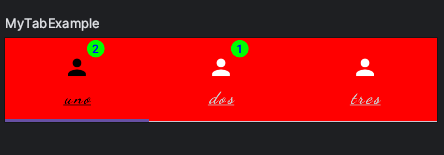
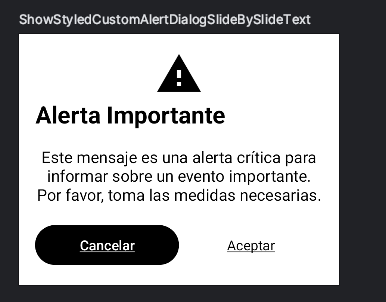
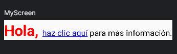

# UI Components (Android used)


# Table of Components
- [Component](#component)
    - [CustomTabView](#customtabview-comprehensive-implementation-guide)
        - [Building a Customizable Tab Interface with Kotlin](#building-a-customizable-tab-interface-with-kotlin)
        - [Key Features](#key-features)
        - [Core Components](#core-components)
            - [CustomTabItem](#customtabitem)
            - [IconStyleConfig, BadgeStyleConfig, TextStyleConfig](#iconstyleconfig-badgestyleconfig-textstyleconfig)
            - [CustomTabViewColors & CustomTabViewDefaults](#customtabviewcolors--customtabviewdefaults)
        - [Implementation Process](#implementation-process)
            - [Implementation Example](#implementation-example)
        - [In Summary](#in-summary)
    - [CustomAlertView](#customalertview-comprehensive-implementation-guide)
        - [Creating Dynamic Alert Dialogs in Kotlin](#creating-dynamic-alert-dialogs-in-kotlin)
        - [Key Features](#key-features-1)
        - [Core Components](#core-components-1)
            - [IconStyleConfig, CardStyleConfig](#iconstyleconfig-cardstyleconfig)
            - [CustomAlertDialogColors & CustomAlertDialogDefaults](#customalertdialogcolors--customalertdialogdefaults)
            - [DialogButtonConfig](#DialogButtonConfig)
            - [AlertDialogContent](#alertdialogcontent)
            - [Enumeration Types](#enumeration-types)
        - [Implementation Process](#implementation-process-1)
            - [Implementation Example](#implementation-example-1)
        - [In Summary](#in-summary-1)
    - [HyperlinkCustom](#hyperlinkcustom-comprehensive-implementation-guide)
        - [Building a Text Component with Clickable Hyperlinks in Kotlin](#building-a-text-component-with-clickable-hyperlinks-in-kotlin)
        - [Key Features](#key-features-2)
        - [Core Components](#core-components-2)
            - [TextStyleSpan](#textstylespan)
            - [TextSegment](#textsegment)
            - [SegmentType](#segmenttype)
        - [Implementation Process](#implementation-process-2)
            - [Implementation Example](#implementation-example-2)
        - [In Summary](#in-summary-2)
- [Config](#config)
    - [TextStyleConfig](#textstyleconfig)


# Component

## CustomTabView: Comprehensive Implementation Guide

Dive deep into creating interactive and customizable user interfaces for Android applications using Kotlin and Jetpack Compose. This advanced guide is designed to streamline the process of integrating a CustomTabView component, providing you with all necessary details for implementing rich and adaptive tabbed navigation.

## Building a Customizable Tab Interface with Kotlin
In the sections that follow, we'll cover detailed usage of the CustomTabView component, from initial setup to advanced customization options, ensuring that you can tailor it perfectly to your project's specific needs.

For ease of access and implementation, all relevant code snippets are hosted on Gist, allowing you to directly copy them into your project.

## Key Features
- Customizable Tabs: Configure tabs with text, icons, and notification counts.
- Advanced Styling: Deeply personalize styles for text, icons, and notifications.
- Full Interactivity: Implement specific actions for each tab selection.
- Customizable Color Palette: Choose or define colors for selected and unselected states.

## Core Components
### CustomTabItem
Represents an individual tab item, including text, icon, notification count, and action upon selection.

```
data class CustomTabItem(
    val icon: @Composable (() -> Unit)?,
    val text: String,
    val badgeNumber: Int,
    val action: () -> Unit,
)
```

### IconStyleConfig, BadgeStyleConfig, [TextStyleConfig](#textstyleconfig)
Defines styling configurations for icons, badges, and text within the tabs. These configurations provide a unified way to customize the appearance of various components throughout the UI. TextStyleConfig is particularly noteworthy as it is housed within the config directory, underscoring its utility across multiple components beyond just tabs. This centralized approach facilitates consistent styling across the application, allowing for text appearance to be easily adjusted and reused.

```
data class IconStyleConfig(
    val modifier: Modifier = Modifier,
    val tint: Color = Color.Unspecified,
    val selectedTint: Color = Color.Unspecified,
    val unselectedTint: Color = Color.Unspecified
)

data class BadgeStyleConfig(
    val backgroundColor: Color = Color.Unspecified,
    val textColor: Color = Color.Unspecified,
    val modifier: Modifier = Modifier,
)

```

### CustomTabViewColors & CustomTabViewDefaults
Sets up the color configuration for the tab view, including default options.

```
data class CustomTabViewColors(
    val selectedColor: Color,
    val unselectedColor: Color,
    val contentColor: Color,
    val backgroundColor: Color
)

object CustomTabViewDefaults {
    @Composable
    fun colors(
        selectedColor: Color = MaterialTheme.colorScheme.primary,
        unselectedColor: Color = MaterialTheme.colorScheme.onSurfaceVariant,
        contentColor: Color = MaterialTheme.colorScheme.onSurface,
        backgroundColor: Color = Color.Transparent
    ) = CustomTabViewColors(selectedColor, unselectedColor, contentColor, backgroundColor)
}
```

## Implementation Process
1. Define Tabs: Create a list of CustomTabItem, defining text, icon, notification count, and action for each tab.
3. Configure Styles: Optionally, adjust the appearance using IconStyleConfig, BadgeStyleConfig, and TextStyleConfig.
5. Select Colors: Use CustomTabViewColors to set your preferred colors or utilize the default configurations with CustomTabViewDefaults.colors().
7. Integrate CustomTabView: Add the CustomTabView component to your UI, specifying the tabs, color, and style configurations.

### Implementation Example
```
@Preview(showBackground = true)
@Composable
fun MyTabExample() {
    Column {

        val tabs = listOf(
            CustomTabItem(
                icon = { Icon(Icons.Filled.Person, contentDescription = "Profile") },
                text = "uno",
                badgeNumber = 2,
                action = { }
            ),
            CustomTabItem(
                icon = { Icon(Icons.Filled.Person, contentDescription = "Profile") },
                text = "dos",
                badgeNumber = 1,
                action = { }
            ),
            CustomTabItem(
                icon = { Icon(Icons.Filled.Person, contentDescription = "Profile") },
                text = "tres",
                badgeNumber = 0,
                action = { }
            )
        )

        CustomTabView(
            tabs = tabs,
            colors = CustomTabViewColors(
                backgroundColor = Color.Red,
                contentColor = Color.White,
                selectedColor = Color.Black,
                unselectedColor = Color.LightGray
            ),
            onTabSelected = { position ->
                println("Tab seleccionado en la posición: $position")
            },
            textStyleConfig = TextStyleConfig(
                fontSize = 15.sp,
                fontWeight = FontWeight.Bold,
                fontStyle = FontStyle.Italic,
                fontFamily = FontFamily.Cursive,
                maxLines = 1,
                textDecoration = TextDecoration.Underline,
                letterSpacing = 2.sp,
                minLines = 1,
                overflow = TextOverflow.Clip,
                softWrap = true,
                modifier = Modifier.padding(0.dp)
            ),
            iconStyleConfig = IconStyleConfig(
                unselectedTint = Color.White,
                selectedTint = Color.Black,
                tint = Color.White,
                modifier = Modifier.padding(1.dp)
            ),
            badgeStyleConfig = BadgeStyleConfig(
                textColor = Color.Blue,
                backgroundColor = Color.Green
            )
        )

    }
}
```


## In Summary
With the CustomTabView guide, you have at your disposal a highly configurable tab navigation component for Jetpack Compose, enhancing the interactivity and design of your Android applications. Integrating code snippets from Gist facilitates an efficient and straightforward implementation.

## CustomAlertView: Comprehensive Implementation Guide

This section outlines the process of creating and customizing alert dialogs within Android applications using Kotlin and Jetpack Compose. The `CustomAlertView` component offers extensive customization options to cater to different needs and aesthetics.

### Creating Dynamic Alert Dialogs in Kotlin

The CustomAlertView component allows developers to create highly customizable alert dialogs that can contain a variety of content and actions. These dialogs are designed to fit seamlessly within the UI of any Android app.

### Key Features

- Highly customizable alert dialogs.
- Support for text, icons, and buttons within the dialog.
- Flexible layout configurations for buttons.
- Customizable color schemes for different parts of the alert dialog.

## Core Components

### IconStyleConfig,CardStyleConfig

Defines styling options for various components within the CustomAlertView. These configurations allow for extensive customization of appearance, including icons, cards, and buttons. `TextStyleConfig` is shared across multiple components and is located in a different directory, [see TextStyleConfig](#textstyleconfig).

```
data class IconStyleConfig(
    val modifierIcon: Modifier = Modifier,
    val tint: Color = Color.Unspecified,
    val selectedTint: Color = Color.Unspecified,
    val unselectedTint: Color = Color.Unspecified,
    val horizontalArrangement: Arrangement.Horizontal = Arrangement.Center
)

data class CardStyleConfig(
    val modifier: Modifier = Modifier,
    val shape: Shape = RoundedCornerShape(0.dp),
    val backgroundColor: Color = Color.Unspecified,
    val contentColor: Color = Color.Unspecified,
    val elevation: Dp = 0.dp,
    val border: BorderStroke? = null
)
```

### CustomAlertDialogColors & CustomAlertDialogDefaults

Specifies the color scheme for the alert dialog and provides default configurations. This facilitates easy alignment with the Material Theme's color scheme and supports customization for content, background, icon, title, and message colors.

```
data class CustomAlertDialogColors(
    val contentColor: Color,
    val backgroundColor: Color,
    val iconColor: Color,
    val titleColor: Color,
    val messageColor: Color
)

object CustomAlertDialogDefaults {
    @Composable
    fun colors(
        contentColor: Color = MaterialTheme.colorScheme.onSurface,
        backgroundColor: Color = Color.Transparent,
        iconColor: Color = contentColor,
        titleColor: Color = contentColor,
        messageColor: Color = contentColor
    ) = CustomAlertDialogColors(contentColor, backgroundColor, iconColor, titleColor, messageColor)
}

```
### DialogButtonConfig
Defines the structure and behavior of buttons within the alert dialog, including labels, actions, and customizable appearance.

```
data class DialogButtonConfig(
    val label: String,
    val containerColor: Color = Color.Unspecified,
    val contentColor: Color = Color.Unspecified,
    val disabledContainerColor: Color = Color.Unspecified,
    val disabledContentColor: Color = Color.Unspecified,
    val modifier: Modifier = Modifier,
    val typeButtonStyle: TypeButtonStyle
)

```

### AlertDialogContent
Represents the content structure of the alert dialog, including optional title, message, icon, and buttons.

```
data class AlertDialogContent(
    val title: String? = null,
    val message: String,
    val icon: ImageVector? = null,
    val buttons: List<DialogButtonConfig> = emptyList()
)

```

### Enumeration Types
Defines enumeration types for configuring the layout and style of buttons within the alert dialog, enhancing the flexibility and customization of dialog interactions.

```
enum class ButtonLayoutStyle {
    SideBySide,
    Stacked,
}

enum class TypeButtonStyle {
    Button,
    Text,
}

```

## Implementation Process
The process to integrate CustomAlertView into your Android application involves several key steps:

1. Define Content: Utilize the AlertDialogContent data class to specify the title, message, icon, and buttons you wish to include in your alert dialog.
2. Customize Appearance: Adjust the visual aspects of your dialog through CustomAlertDialogColors, TextStyleConfig for text elements, IconStyleConfig for icons, and CardStyleConfig for the card background.
3. Configure Behavior: Decide on the layout of your buttons using ButtonLayoutStyle and the style of buttons (Button or Text) with TypeButtonStyle.
4. Handle Dismissal: Provide logic for what happens when the dialog is dismissed either through the onDismissRequest callback or the onDismissBoolean flag.

### Implementation Example
Below is an illustrative example of how to implement a CustomAlertDialog within a Compose UI. This example showcases a critical alert message with a single action button:

```
@Preview(showBackground = true)
@Composable
fun ShowStyledCustomAlertDialogSlideBySlideText() {
    CustomAlertDialog(
        content = AlertDialogContent(
            title = "Alerta Importante",
            message = "Este mensaje es una alerta crítica para informar sobre un evento importante. Por favor, toma las medidas necesarias.",
            icon = Icons.Filled.Warning,
            buttons = listOf(
                DialogButtonConfig(
                    label = "Cancelar",
                    containerColor = Color.Black,
                    contentColor = Color.White,
                    disabledContainerColor = Color.Gray,
                    disabledContentColor = Color.DarkGray,
                    typeButtonStyle = TypeButtonStyle.Button
                ),
                DialogButtonConfig(
                    label = "Aceptar",
                    containerColor = Color.Black,
                    contentColor = Color.Black,
                    disabledContainerColor = Color.Gray,
                    disabledContentColor = Color.DarkGray,
                    typeButtonStyle = TypeButtonStyle.Text
                )
            )
        ),
        onDismissRequest = {},
        onFirstActionButton = {},
        onSecondActionButton = {},
        colors = CustomAlertDialogDefaults.colors(
            contentColor = Color.Black,
            backgroundColor = Color.White,
            iconColor = Color.Black,
            titleColor = Color.Black,
            messageColor = Color.Black
        ),
        titleTextStyle = TextStyleConfig(
            fontSize = 24.sp,
            fontWeight = FontWeight.Bold,
            modifier = Modifier.padding(bottom = 8.dp)
        ),
        messageTextStyle = TextStyleConfig(
            fontSize = 16.sp,
            modifier = Modifier.padding(bottom = 16.dp)
        ),
        iconStyleConfig = IconStyleConfig(
            modifierIcon = Modifier.size(48.dp),
            tint = Color.Black,
        ),
        buttonLayoutStyle = ButtonLayoutStyle.SideBySide,
        onDismissEnable = true,
        buttonTextStyle = TextStyleConfig(
            textDecoration = TextDecoration.Underline
        )
    )
}
```


This composable function ShowStyledCustomAlertDialogSlideBySlideText showcases the usage of the CustomAlertDialog component. It creates an AlertDialog with a title, message, and icon, along with two buttons: "Cancel" and "Accept". The appearance and behavior of each component are customized using various parameters such as colors, text styles, icon styles, and button layout style. This example demonstrates how developers can create visually appealing and functional alert dialogs tailored to their application's needs.

## In Summary
The CustomAlertView component provides a flexible and customizable way to display alert dialogs within your Android applications using Jetpack Compose. By following the implementation process and adapting the example to your needs, you can create dynamic and visually appealing alert dialogs that enhance user interaction and convey critical information effectively.


## hyperlinkcustom comprehensive implementation guide

### Building a Text Component with Clickable Hyperlinks in Kotlin

This document outlines a customizable text component capable of displaying clickable hyperlinks, ideal for Android apps using Kotlin and Jetpack Compose. It's particularly useful for applications that require interactive text elements within their UI.

### Key Features

- Interactive Text Segments: The ability to divide text into interactive segments, with customizable actions for each.
- Extensive Styling Options: Complete control over the styling of text, including but not limited to color, size, and font weight through TextStyleSpan.
- Clickable Hyperlinks: Easy creation of clickable text segments, perfect for hyperlinks, with customizable click actions.
- Adaptive Layout: Designed to fit into a wide array of UI designs, customizable with Compose's Modifier.

## Core Components

### TextStyleSpan

Encapsulates styling information for a text segment, allowing for detailed customization.

- Provides styling options like color, fontSize, fontWeight, and many more to define the appearance of a text segment.
- Advanced styling features such as fontStyle, letterSpacing, textDecoration, and shadow for comprehensive text appearance control.

```
data class TextStyleSpan(
    val color: Color? = null,
    val fontSize: TextUnit? = null,
    val fontWeight: FontWeight? = null,
    val fontStyle: FontStyle? = null,
    val fontSynthesis: FontSynthesis? = null,
    val fontFamily: FontFamily? = null,
    val fontFeatureSettings: String? = null,
    val letterSpacing: TextUnit = TextUnit.Unspecified,
    val baselineShift: BaselineShift? = null,
    val textGeometricTransform: TextGeometricTransform? = null,
    val localeList: LocaleList? = null,
    val background: Color = Color.Unspecified,
    val textDecoration: TextDecoration? = null,
    val shadow: Shadow? = null,
)
```

### TextSegment

Represents a segment of the overall text. Each segment can have its own style and, if it's a hyperlink, its own click action.

- text: The string content of the segment.
- type: Specifies whether the segment is regular text or a hyperlink.
- styleConfig: Optional configuration for text styling, applied via TextStyleSpan.
- action: An optional lambda function that executes when the segment is clicked, used for hyperlinks.

```
data class TextSegment(
    val text: String,
    val type: SegmentType,
    val styleConfig: TextStyleSpan? = null,
    val action: (() -> Unit)? = null
)
```

### SegmentType

Defines the type of text segment, which can either be plain text (TEXT) or a hyperlink (LINK).

```
enum class SegmentType {
    TEXT, LINK
}
```

## Implementation Process

1. Create a list of TextSegment objects for your text, specifying the content, type, style (if any), and action (for links).
2. Use the HyperlinksText composable function in your UI, passing the list of segments and any desired modifiers for further customization.
3. Adjust the appearance of each segment with TextStyleSpan, tailoring your text to fit your app's design seamlessly.

### Implementation Example

```
@Preview(showBackground = true)
@Composable
fun MyScreen() {
    val segments = listOf(
        TextSegment(
            text = "Hola, ",
            type = SegmentType.TEXT,
            styleConfig = TextStyleSpan(
                color = Color.Red,
                fontSize = 29.sp,
                fontWeight = FontWeight.Bold
            )
        ),
        TextSegment(
            text = "haz clic aquí",
            type = SegmentType.LINK,
            styleConfig = TextStyleSpan(
                color = Color.Blue,
                textDecoration = TextDecoration.Underline
            ),
            action = { println("Enlace tocado") }
        ),
        TextSegment(
            text = " para más información.",
            type = SegmentType.TEXT,
            styleConfig = TextStyleSpan(color = Color.Black)
        )
    )

    HyperlinksText(segments = segments)
}

```


This example showcases how to construct a piece of text composed of different segments, including a clickable hyperlink, using HyperlinksText. The segments have been styled individually to demonstrate the flexibility of the component.

## In Summary
The text component with clickable hyperlinks provides a robust solution for displaying interactive text in Android applications. Through Kotlin and Jetpack Compose, it offers detailed customization options, enabling it to cater to various use cases where enhanced text interaction is required.

# Config
The config folder is a dedicated space that contains configurations for components used in more than one place within the application, such as TextStyleConfig. Centralizing these configurations promotes a DRY (Don't Repeat Yourself) principle, making the codebase more maintainable and ensuring a cohesive visual and functional design.

### TextStyleConfig

TextStyleConfig
Located in the config directory, TextStyleConfig outlines styling options for text, serving a critical role in ensuring text consistency across different UI components. By adjusting properties such as font size, weight, style, and color, developers can easily apply uniform text styling throughout the application, enhancing the user interface's overall aesthetic and readability.
```
data class TextStyleConfig(
    val fontSize: TextUnit = TextUnit.Unspecified,
    val fontStyle: FontStyle? = null,
    val fontWeight: FontWeight? = null,
    val fontFamily: FontFamily? = null,
    val letterSpacing: TextUnit = TextUnit.Unspecified,
    val textDecoration: TextDecoration? = null,
    val overflow: TextOverflow = TextOverflow.Clip,
    val softWrap: Boolean = true,
    val maxLines: Int = Int.MAX_VALUE,
    val minLines: Int = 1,
    val textAlign: TextAlign? = null,
    val modifier: Modifier = Modifier
)

```


